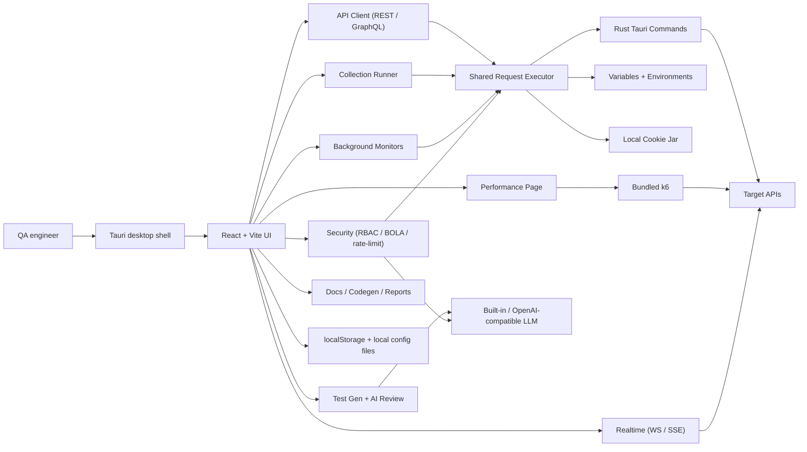

# QA Companion

[](#license)
[](#architecture)
[](#architecture)
[](#development)
[](#development)
[](#k6-binary)
[](#local-data-and-secrets)

[繁體中文](README.zh-TW.md)

QA Companion is a local-first desktop workspace for API QA. It combines a
Postman-compatible API client (REST and GraphQL), live collection execution,
background monitors,
k6 performance testing, security testing (RBAC, object-authz, and rate-limit)
with AI triage, AI-assisted test generation, AI response review, and
exportable API documentation in one Tauri app.

## Screenshots

**A local-first, Postman-compatible desktop workspace for API QA** — API client,
collection runner, security matrix, monitors, performance testing, and exportable
docs in one app.


| Security matrix (RBAC) | AI test generation | API client |
| --- | --- | --- |
|  |  |  |
| **Generated API docs** | **Performance / load testing** | **Realtime (WebSocket / SSE)** |
|  |  |  |

<sub>Regenerate with `node scripts/capture-screenshots.mjs` while the dev server is running (drives your system Chrome over the DevTools Protocol; set `LOCALE=zh-TW` for a Chinese UI).</sub>

## Current Scope

The current public-facing scope is API testing only:

- Generic API environments for local, staging, production, and custom targets
- Local request execution through the Tauri desktop backend
- Browser/dev fallback paths for deterministic tests and quick UI iteration
- Runtime data and credentials stored on the local machine
- No company-specific services, internal links, or obsolete non-API workflow docs

## Capabilities

- **API client**: build HTTP and GraphQL requests (with a schema explorer),
  switch environments, inspect responses, view call history, and export
  responses and history as HTML, JSON, or CSV reports.
- **Import/export**: import Postman v2.1 collections and OpenAPI/Swagger JSON;
  export collections back to Postman JSON.
- **Authentication**: No Auth, Bearer Token, OAuth 2.0 (authorization-code,
  client-credentials, and password grants), API Key, Basic Auth, and AWS SigV4.
- **Variables and cookies**: resolve global, collection, environment, and local
  variables plus dynamic values ({{$timestamp}}, {{$guid}}, {{$randomInt}});
  replay matching cookies through the local cookie jar.
- **Collection Runner**: run selected requests, iterate over CSV/JSON data, and
  score assertions on live responses.
- **Security testing**: run an identity × endpoint RBAC matrix — the same saved
  requests sent under multiple identities — with per-cell allow/deny expectations,
  a configurable deny-status set, and response oracles that flag sensitive-data
  exposure and schema drift. Object-level authorization (BOLA/IDOR) testing swaps
  object ids across identities with auto-detected id locations, reusable
  cross-tenant presets, and a negative control that suppresses false positives.
  Rate-limit / abuse testing fires bounded request bursts behind a confirm gate.
- **AI security triage**: condense a whole scan (matrix + object-authz + rate-limit)
  into a short, prioritized, categorized shortlist — what to look at first, what
  looks like a real issue, and what's likely a false positive — advisory only,
  never altering the underlying findings.
- **Findings lifecycle**: suppress false positives, override severity, and assign
  owner/status/note, then diff each run against a pinned baseline — new/carried/resolved
  badges plus a new-high/critical counter.
- **Monitors**: run live checks manually or let enabled monitors execute on
  their configured cadence while the app is running.
- **Performance testing**: generate and run k6 performance, load, and stress
  tests with live metrics, SLO scoring, history, and exportable reports.
- **AI assistance**: generate classified test cases from BDD, OpenAPI, PRD, or
  PDF-like text; review individual API responses against existing assertions; and
  scan a response on demand for sensitive-data exposure (PII, secrets, internal
  or debug fields).
- **Configurable AI provider**: every AI feature (test generation, response
  review, sensitive-data scan, and security triage) runs on a provider you
  choose — built-in Claude with no API key, OpenAI, or any OpenAI-compatible
  endpoint — with credentials kept on the local machine.
- **Docs and codegen**: generate API docs, standalone HTML exports, and request
  code snippets (cURL, Python, JavaScript, HTTPie).
- **Realtime testing**: test WebSocket and Server-Sent Events streams.
- **Bilingual, themeable UI**: complete English and Traditional Chinese (繁體中文)
  interface, switchable in Settings, with a themeable dark UI (multiple accent
  palettes and density options).

## Architecture



- **Frontend**: React 18 + Vite
- **Desktop shell**: Tauri 2
- **Backend commands**: Rust, including request execution, process helpers, and
  local file operations
- **Performance engine**: k6, materialized into `src-tauri/resources/`
- **Tests**: Vitest + Testing Library for the frontend and Rust unit tests for
  Tauri helpers

## What Changed In This Refactor

<details>
<summary>Refactor notes</summary>

- Repositioned the product around API QA workflows instead of the earlier broad
  desktop utility scope.
- Removed obsolete non-API workflow descriptions from the public README and docs.
- Kept the useful API testing surface: import, send, run, monitor, review,
  document, export, and performance-test requests.
- Promoted live execution paths: Runner and Monitors evaluate assertions against
  real responses instead of demo-only data.
- Added an app-level monitor scheduler so enabled monitors run on cadence while
  the app is open.
- Consolidated LLM usage through shared settings for Test Gen and response
  review.

</details>

## Requirements

- Node.js 18 or newer
- npm
- Rust toolchain for Tauri commands and desktop builds
- k6 is handled by the setup scripts described below

## Development

<details open>
<summary>Common commands</summary>

Install dependencies:

```bash
npm install
```

Run the frontend dev server:

```bash
npm run dev
```

Run the Tauri desktop app in development mode:

```bash
npm run tauri:dev
```

Run tests:

```bash
npm test
```

Build the frontend:

```bash
npm run build
```

Build the desktop app:

```bash
npm run tauri:build
```

</details>

## k6 Binary

<details>
<summary>k6 setup and release verification</summary>

The Performance page runs real load tests through k6. The binary is not
committed because it is large and platform-specific.

The setup script materializes it at `src-tauri/resources/`:

- **Dev**: `npm run setup:k6` is a no-op if k6 already exists, otherwise it
  copies `k6` from PATH or downloads the pinned release.
- **Release**: `npm run setup:k6:release` downloads the OS/arch-correct official
  artifact, verifies SHA256 checksums stored in `scripts/setup-k6.mjs`, and
  confirms `k6 version` before bundling.

Manual commands:

```bash
npm run setup:k6
npm run setup:k6:release
```

When bumping `K6_VERSION=<x.y.z>`, add that release's checksums to the
`CHECKSUMS` table in `scripts/setup-k6.mjs`; release builds fail closed if the
checksum is missing or mismatched.

</details>

## Local Data And Secrets

<details>
<summary>Stored files and secret handling</summary>

Runtime configuration is stored locally. Common generated files include:

- `config.json` for application settings
- `postman_collections_cache.json` for cached collection metadata
- `api_credential_configs.json` for reusable API credential profile metadata

LLM settings are stored in browser localStorage and sent directly to the chosen
provider. Do not commit credentials, generated cache files, local tokens, or
machine-specific paths.

</details>

## Packaging Notes

<details>
<summary>macOS, Windows, and Gatekeeper notes</summary>

macOS builds produce a `.dmg` under
`src-tauri/target/release/bundle/dmg/`. Windows builds produce an NSIS
installer. The macOS k6 binary is bundled into the app at
`Contents/Resources/resources/k6`, so Performance testing works without a
system k6 install.

The current macOS build is not signed or notarized with an Apple Developer ID.
On first launch, Gatekeeper may block it. Bypass it once by right-clicking the
app and choosing **Open**, or by clearing quarantine:

```bash
xattr -dr com.apple.quarantine "/Applications/QA Companion.app"
```

For wider distribution, sign and notarize the build.

</details>

## License

ISC
