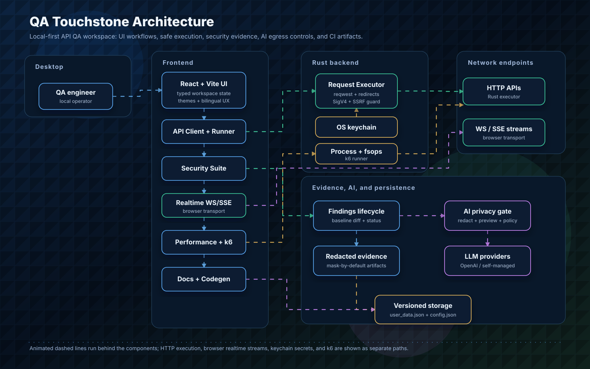

# QA Touchstone

[](https://github.com/asdfghj1237890/qa-touchstone/actions/workflows/ci.yml)
[](#license)
[](#architecture)
[](#architecture)
[](#architecture)
[](#development)
[](#development)
[](#k6-binary)
[](#local-data-and-secrets)

[繁體中文](README.zh-TW.md)

QA Touchstone is a local-first desktop tool for **API security testing in CI**:
run an identity × endpoint RBAC matrix, BOLA/IDOR object-authorization tests,
and rate-limit abuse checks against your real API, manage findings across runs
with baseline diffs, and export **SARIF / JUnit / HTML / JSON** artifacts your
pipeline can gate on. Around that core it ships the full supporting workbench —
a Postman-compatible API client (REST and GraphQL), live collection execution,
background monitors, k6 performance testing, AI-assisted test generation and
triage, and exportable API documentation — in one Tauri app.

## Screenshots

**A local-first, Postman-compatible desktop workspace for API QA** — API client,
collection runner, security matrix, monitors, performance testing, and exportable
docs in one app.


| Security matrix (RBAC)                                      | AI test generation                                             | API client                                            |
| ----------------------------------------------------------- | -------------------------------------------------------------- | ----------------------------------------------------- |
|  |  |      |
| **Generated API docs**                                      | **Performance / load testing**                                 | **Realtime (WebSocket / SSE)**                        |
|      |     |  |

<sub>Regenerate with `node scripts/capture-screenshots.mjs` while the dev server is running (drives your system Chrome over the DevTools Protocol; set `LOCALE=zh-TW` for a Chinese UI).</sub>

## Documentation

- [Getting Started](docs/getting-started.md) — clone → first request → first scan
- [Capability Matrix](docs/capability-matrix.md) — what runs on desktop vs the headless CLI
- [Security Workflow](docs/security-workflow.md) — the RBAC / BOLA / rate-limit journey end to end
- [Design System](docs/design-system.md) — theming, tokens, and UI primitives
- [AI-era API Testing Assessment](docs/ai-era-api-testing-assessment.md) — the product thesis
- [CHANGELOG](CHANGELOG.md) · [Architecture diagram](docs/architecture.svg)

## Current Scope

The current public-facing scope is API testing only:

- Generic API environments for local, staging, production, and custom targets
- Local request execution through the Tauri desktop backend
- Browser/dev fallback paths for deterministic tests and quick UI iteration
- Runtime data and credentials stored on the local machine
- No company-specific services, internal links, or obsolete non-API workflow docs

## Capabilities

- **API client**: build HTTP and GraphQL requests (with a schema explorer),
  switch environments, inspect responses, view call history, and export
  responses and history as HTML, JSON, or CSV reports.
- **Import/export**: import Postman v2.1 collections and OpenAPI/Swagger JSON;
  export collections back to Postman JSON.
- **Authentication**: No Auth, Bearer Token, OAuth 2.0 (authorization-code,
  client-credentials, and password grants), API Key, Basic Auth, and AWS SigV4.
- **Variables and cookies**: resolve global, collection, environment, and local
  variables plus dynamic values ({{$timestamp}}, {{$guid}}, {{$randomInt}});
  replay matching cookies through the local cookie jar.
- **Collection Runner**: run selected requests, iterate over CSV/JSON data, and
  score assertions on live responses.
- **Security testing**: run an identity × endpoint RBAC matrix — the same saved
  requests sent under multiple identities — with per-cell allow/deny expectations,
  a configurable deny-status set, and response oracles that flag sensitive-data
  exposure and schema drift. The matrix oracle is body-aware: a 200 that denies
  in-band (`{"error":"Access denied"}`) is classified as denied, not a false vuln.
  Object-level authorization (BOLA/IDOR) testing swaps
  object ids across identities with auto-detected id locations, reusable
  cross-tenant presets, and a negative control that suppresses false positives
  (id echoes only count at identity-like keys, and the control is scored by an
  independent structural oracle). Rate-limit / abuse testing fires bounded
  request bursts behind a confirm gate and grades protection none / weak /
  strong by how many requests slip through before the first 429.
  A single **Run full security suite** executes all three engines as one recorded
  run — rate-limit last, so its bursts don't skew the matrix and BOLA results.
  Three further engines — input **fuzzing** (5xx, stack-trace-leak, and
  reflected-payload detection), an auto-derived **BFLA** (OWASP API5) scan, and
  JSON-Schema/OpenAPI **conformance** validation — are pure, fully unit-tested
  modules with SARIF rule metadata in the report layer. Fuzzing and BFLA run on
  both surfaces (desktop Security suite and the headless `scan` command);
  conformance currently runs in the desktop suite only (no Rust port yet, so the
  CLI does not run it). See [docs/capability-matrix.md](docs/capability-matrix.md)
  for exactly what runs where.
- **AI security triage**: condense a whole scan (matrix + object-authz + rate-limit)
  into a short, prioritized, categorized shortlist — what to look at first, what
  looks like a real issue, and what's likely a false positive — advisory only,
  never altering the underlying findings.
- **Findings lifecycle**: suppress false positives, override severity, and assign
  owner/status/note, then diff each run against a pinned baseline — new/carried/resolved
  badges plus a new-high/critical counter.
- **Security reports / CI artifacts**: export a completed suite run as a JSON
  artifact, an HTML executive report, JUnit XML (CI test checks), or SARIF
  (GitHub code scanning) — gated on new high/critical findings, with three
  redaction levels for artifacts that leave the machine: `strict` omits evidence
  entirely, `redacted` keeps a short masked value, and `evidence` attaches a
  structure-preserving, **mask-by-default** request/response summary that locates
  each finding while guaranteeing tokens, cookies, and PII never leak (every leaf
  is type-tokenized except the finding itself). The evidence summary is generated
  on demand and only persisted into a run on explicit opt-in. SARIF output is
  code-scanning-ready: rules carry names, descriptions, `helpUri`, CWE/OWASP
  tags, and a GitHub `security-severity` score, and each result carries a
  `physicalLocation`.
- **Monitors**: run live checks manually or let enabled monitors execute on
  their configured cadence while the app is running.
- **Performance testing**: generate and run k6 performance, load, and stress
  tests with live metrics, SLO scoring, history, and exportable reports.
- **AI assistance**: generate classified test cases from BDD, OpenAPI, PRD, or
  PDF-like text; review individual API responses against existing assertions; and
  scan a response on demand for sensitive-data exposure (PII, secrets, internal
  or debug fields).
- **Configurable AI provider**: every AI feature (test generation, response
  review, sensitive-data scan, and security triage) runs on a provider you
  choose — OpenAI, or a custom / self-managed (enterprise on-prem)
  OpenAI-compatible endpoint — with credentials kept on the local machine.
  AI features are optional: without a configured provider, test generation
  falls back to a built-in heuristic engine and the rest of the app works
  fully. (A keyless built-in Claude provider exists but only functions when
  the UI runs inside a claude.ai Artifacts sandbox — it is **not available in
  the desktop builds**; the Settings page shows its live availability.)
- **AI privacy mode**: all AI calls pass through one egress chokepoint that is
  redacted-by-default. Three modes — `full context`, `redacted` (default), and
  `local only` — control what leaves the machine. `redacted` masks URLs (host
  stripped), bodies (structure-preserving — values become type tokens, keys
  kept), headers, and identifiers (email, tokens, UUID, IP, Luhn-valid cards,
  SSN) locally before sending, and reduces OpenAPI specs to path shape (no real
  host, no example values). `local only` blocks cloud providers and allows only
  a self-managed endpoint (loopback / private / explicitly attested). A preview
  shows the exact prompt before it is sent, and a CI / org lockdown (env
  `QA_ALLOW_EXTERNAL_AI`) can force external AI off.
- **Docs and codegen**: generate API docs, standalone HTML exports, and request
  code snippets (cURL, Python, JavaScript, HTTPie).
- **Realtime testing**: test WebSocket and Server-Sent Events streams.
- **Bilingual, themeable UI**: complete English and Traditional Chinese (繁體中文)
  interface, switchable in Settings, with a themeable dark UI (multiple accent
  palettes and density options).

## Architecture



- **Frontend**: React 19 + Vite, **100% TypeScript** (strict). Workspace,
  request/send, and monitor state live in typed React context providers
  (`src/qa/state/`); shared domain types in `src/qa/types.ts`.
- **Desktop shell**: Tauri 2
- **Backend commands**: Rust — request execution (reqwest + manual redirect
  following, AWS SigV4, and an SSRF guard that blocks signed requests to
  cloud-metadata addresses), the k6 process runner, temp-file helpers, local
  config/data persistence, OS-keychain secret storage (`keyring`), and a
  text-file save command fed by the native save dialog. The renderer's command
  surface is intentionally minimal (no shell, no arbitrary network access), and
  disabling TLS verification requires an explicit renderer confirmation and is
  audit-logged.
- **Security engine (source of truth)**: the RBAC-matrix scan runs in the shared
  Rust core (`src-tauri/core`) over IPC (`run_security_matrix`) — the same engine
  the headless CLI uses — with the TypeScript engine (`src/qa/*.ts`) as a
  parity-gated browser fallback. Other engines (BOLA, rate-limit, BFLA, fuzz) still
  run in TypeScript on the desktop for now.
- **Storage**: a single versioned layer (`src/qa/storage.ts`) with on-read
  migrations mirrors critical workspace data to disk via the Rust backend; the
  cookie jar enforces the full Public Suffix List (`src/qa/psl.ts`).
- **Performance engine**: k6, materialized into `src-tauri/resources/`
- **Tests + checks**: Vitest + Testing Library and Rust unit tests, gated in CI
  alongside `tsc --noEmit`, ESLint, `npm audit`, and `cargo audit`, with
  workflow actions pinned to commit SHAs.

## Project Status

Actively maintained. The frontend is fully strict TypeScript; every push runs
ESLint, `tsc --noEmit`, the Vitest suite, `npm audit`, and Rust unit tests, and
the release pipeline refuses to build installers unless those pass. See
[CHANGELOG.md](CHANGELOG.md) for the per-release history (recent work:
OS-keychain credential storage, hardened RBAC/BOLA/rate-limit oracles, three
new security engines — conformance, fuzzing, BFLA — richer SARIF, and the
React 19 upgrade).

## Requirements

- Node.js 20 or newer (CI runs on 22)
- npm
- Rust toolchain for Tauri commands and desktop builds
- k6 is handled by the setup scripts described below

## Development

<details open>
<summary>Common commands</summary>

Install dependencies:

```bash
npm install
```

Run the frontend dev server:

```bash
npm run dev
```

Run the Tauri desktop app in development mode:

```bash
npm run tauri:dev
```

Run tests:

```bash
npm test
```

Type-check, lint, and format:

```bash
npm run typecheck
npm run lint
npm run format
```

Build the frontend:

```bash
npm run build
```

Build the desktop app:

```bash
npm run tauri:build
```

</details>

## Headless CI Runner

<details open>
<summary>Run QA Touchstone without the desktop UI</summary>

`qa-touchstone-ci` is a standalone, headless runner for CI systems. It does not
link Tauri or the OS keychain layer, so it can run in a normal GitHub Actions,
GitLab CI, Jenkins, or container job. Tagged releases publish these CLI assets
alongside the desktop installers:

- `qa-touchstone-ci-linux-x64.tar.gz`
- `qa-touchstone-ci-macos-<arch>.tar.gz`
- `qa-touchstone-ci-windows-x64.zip`
- matching `.sha256` checksum files

From releases that include the npm/action wrappers, install it with either:

```bash
# npm package versions do not include the leading "v".
npx qa-touchstone-ci@<version> --version
```

or in GitHub Actions:

```yaml
- uses: asdfghj1237890/qa-touchstone/setup-ci@vX.Y.Z
  with:
    version: vX.Y.Z
```

Both wrappers download the matching GitHub Release asset, verify its `.sha256`
file, cache or install the binary, and then run the same `qa-touchstone-ci`
executable documented below. Manual artifact download remains supported for
locked-down CI environments. The release workflow publishes the npm launcher
only when the repository variable `PUBLISH_NPM` is `true` and `NPM_TOKEN` is
available.

The CI surface is the `qa-touchstone-ci` command set below. It is intentionally
smaller than the desktop app: CI jobs run deterministic API, security, and
performance checks from files and environment variables, without the Tauri UI or
OS keychain.

| CI capability                | Command        | Needs network | Needs k6 on runner | Typical CI output                              |
| ---------------------------- | -------------- | ------------- | ------------------ | ---------------------------------------------- |
| Raw smoke probe              | `ping`         | Yes           | No                 | Human status line                              |
| Postman/OpenAPI conversion   | `import`       | No            | No                 | `qa.json` scaffold                             |
| One API request + assertions | `send`         | Yes           | No                 | JSON result                                    |
| Collection/API smoke suite   | `run`          | Yes           | No                 | JSON + optional JUnit XML                      |
| k6-backed performance check  | `perf`         | Yes           | **Yes**            | JSON + optional k6 summary export              |
| Security scan/report gate    | `scan`         | Yes           | No                 | JSON, HTML, JUnit XML, SARIF, baseline updates |
| BOLA config candidate helper | `bola-suggest` | No            | No                 | Human or JSON candidate list                   |

The headless CLI does **not** bundle k6. API checks, collection runs, BOLA
suggestions, imports, and security scans work with only the `qa-touchstone-ci`
binary; the `perf` command requires `k6` to already be installed on the CI
runner, or passed explicitly with `--k6-bin`.

Desktop-only features are not part of the headless artifact: no interactive UI,
no background monitor scheduler, no OS keychain storage, no bundled desktop k6
resource, and no AI-assisted generation flow. In CI, store secrets in the
runner's secret manager and reference them from config as environment-backed
values such as `{ "env": "API_TOKEN" }`.

Build it locally from this repository:

```bash
cargo build --manifest-path src-tauri/Cargo.toml -p qa-touchstone-ci --release
./src-tauri/target/release/qa-touchstone-ci --version
```

A minimal CI config looks like this:

```json
{
  "version": 1,
  "environments": [{ "name": "staging", "variables": { "baseUrl": "https://api.example.com" } }],
  "identities": [
    { "id": "anon", "auth": { "type": "none" } },
    { "id": "api", "auth": { "type": "bearer", "token": { "env": "API_TOKEN" } } }
  ],
  "requests": [
    {
      "id": "health",
      "method": "GET",
      "url": "{{baseUrl}}/health",
      "assertions": [{ "type": "status", "op": "eq", "value": 200 }]
    },
    {
      "id": "admin-users",
      "method": "GET",
      "url": "{{baseUrl}}/admin/users",
      "privileged": true
    }
  ],
  "collections": [{ "id": "smoke", "requests": ["health"] }],
  "security": {
    "matrix": {
      "endpoints": ["admin-users"],
      "expect": { "admin-users": { "anon": "deny", "api": "allow" } }
    }
  }
}
```

Call it step by step:

```bash
# Convert Postman / OpenAPI JSON into qa.json when needed.
qa-touchstone-ci import --input postman.json --base-url https://api.example.com --out qa.generated.json

# Send one request and emit machine-readable JSON.
API_TOKEN="$API_TOKEN" qa-touchstone-ci send \
  --config qa.json \
  --request health \
  --identity api \
  --env staging \
  --json

# Run a collection and write JUnit for CI test results.
API_TOKEN="$API_TOKEN" qa-touchstone-ci run \
  --config qa.json \
  --collection smoke \
  --identity api \
  --env staging \
  --junit reports/qa-run.xml \
  --json > reports/qa-run.json

# Run a k6 performance check. Requires k6 on PATH, or pass --k6-bin /path/to/k6.
k6 version
API_TOKEN="$API_TOKEN" qa-touchstone-ci perf \
  --config qa.json \
  --request health \
  --identity api \
  --env staging \
  --stage 30s:5 \
  --stage 1m:10 \
  --summary-out reports/k6-summary.json \
  --json > reports/k6-run.json

# Run the security suite and emit CI artifacts.
API_TOKEN="$API_TOKEN" qa-touchstone-ci scan \
  --config qa.json \
  --env staging \
  --json \
  --out reports/security.json \
  --html reports/security.html \
  --junit reports/security-junit.xml \
  --sarif reports/security.sarif \
  --fail-on high
```

Exit codes are stable: `0` pass, `1` runtime/network error, `2` invalid input,
`3` security findings at or above `--fail-on`, and `4` assertion failure or a
non-zero k6 result from `perf`. To adopt a current scan as the baseline, run `scan` with
`--baseline .qa/security-baseline.json --update-baseline`; later scans compare
against that file and gate on new findings.

`perf --script-out` writes the generated k6 script for review/debugging. That
script can contain auth headers or tokens, so do not upload it as a CI artifact
unless your secrets policy allows it. The normal temporary script is deleted
after k6 exits.

Example GitHub Actions job in another repository:

```yaml
name: qa-touchstone

on:
  pull_request:
  push:
    branches: [main]

jobs:
  api-security:
    runs-on: ubuntu-latest
    permissions:
      contents: read
      security-events: write
    env:
      QA_TOUCHSTONE_VERSION: v0.22.1
      API_TOKEN: ${{ secrets.API_TOKEN }}
    steps:
      - uses: actions/checkout@v4

      - name: Install QA Touchstone CLI
        uses: asdfghj1237890/qa-touchstone/setup-ci@vX.Y.Z
        with:
          version: ${{ env.QA_TOUCHSTONE_VERSION }}

      - name: Run API smoke collection
        run: |
          mkdir -p reports
          qa-touchstone-ci run \
            --config qa-touchstone.json \
            --collection smoke \
            --identity api \
            --env staging \
            --junit reports/qa-run.xml \
            --json > reports/qa-run.json

      - name: Verify k6 is available
        run: k6 version

      - name: Run k6 performance check
        run: |
          qa-touchstone-ci perf \
            --config qa-touchstone.json \
            --request health \
            --identity api \
            --env staging \
            --stage 30s:5 \
            --summary-out reports/k6-summary.json \
            --json > reports/k6-run.json

      - name: Run security scan
        id: scan
        run: |
          set +e
          qa-touchstone-ci scan \
            --config qa-touchstone.json \
            --env staging \
            --json \
            --out reports/security.json \
            --html reports/security.html \
            --junit reports/security-junit.xml \
            --sarif reports/security.sarif \
            --fail-on high
          code=$?
          echo "exit_code=$code" >> "$GITHUB_OUTPUT"
          exit 0

      - name: Upload SARIF
        if: always()
        uses: github/codeql-action/upload-sarif@v3
        with:
          sarif_file: reports/security.sarif

      - name: Upload QA artifacts
        if: always()
        uses: actions/upload-artifact@v4
        with:
          name: qa-touchstone-reports
          path: reports/

      - name: Fail on QA Touchstone gate
        if: steps.scan.outputs.exit_code != '0'
        run: exit ${{ steps.scan.outputs.exit_code }}
```

Pin action SHAs in production workflows if your organization enforces strict
supply-chain controls.

</details>

## k6 Binary

<details>
<summary>k6 setup and release verification</summary>

The Performance page runs real load tests through k6. The binary is not
committed because it is large and platform-specific.

The setup script materializes it at `src-tauri/resources/`:

- **Dev**: `npm run setup:k6` is a no-op if k6 already exists, otherwise it
  copies `k6` from PATH or downloads the pinned release.
- **Release**: `npm run setup:k6:release` downloads the OS/arch-correct official
  artifact, verifies SHA256 checksums stored in `scripts/setup-k6.mjs`, and
  confirms `k6 version` before bundling.

Manual commands:

```bash
npm run setup:k6
npm run setup:k6:release
```

When bumping `K6_VERSION=<x.y.z>`, add that release's checksums to the
`CHECKSUMS` table in `scripts/setup-k6.mjs`; release builds fail closed if the
checksum is missing or mismatched.

</details>

## Local Data And Secrets

<details>
<summary>Stored files and secret handling</summary>

Runtime configuration is stored locally. Common generated files include:

- `config.json` for application settings
- `postman_collections_cache.json` for cached collection metadata
- `user_data.json` — disk mirror of critical workspace data (security findings
  lifecycle, baselines, perf history, monitors). The app reads/writes these via
  a single versioned storage layer (`src/qa/storage.ts`) that survives a cleared
  webview cache, migrates older data shapes on read, and surfaces write failures
  instead of swallowing them. Secrets (LLM API keys) are deliberately excluded
  from the mirror.

Manual AWS secret access keys are not stored in `config.json`: they live in the
OS keychain (Windows Credential Manager / macOS Keychain / Linux Secret
Service), keyed by credential-profile id. A legacy inline secret is still
honored on read so older configs keep working.

LLM settings are stored in browser localStorage. AI privacy mode is
redacted-by-default: prompts are masked locally and shown in a preview before
being sent to the chosen provider; `local only` mode restricts AI to a
self-managed endpoint, and a CI / org lockdown (`QA_ALLOW_EXTERNAL_AI`) can
disable external AI entirely. Do not commit credentials, generated cache files,
local tokens, or machine-specific paths.

Security run records persist only a compact, redacted snapshot — request/response
bodies are never stored. The richer redacted evidence artifact is held in memory
for the current session and only written into a saved run (or pinned baseline)
when you explicitly opt in.

</details>

## Packaging Notes

<details>
<summary>macOS, Windows, and Gatekeeper notes</summary>

macOS builds produce a `.dmg` under
`src-tauri/target/release/bundle/dmg/`. Windows builds produce both an NSIS
installer (`-x64-setup.exe`) and a no-install portable ZIP (`-x64-portable.zip`)
that holds the executable next to its bundled `resources/k6.exe`. Run
`npm run package:portable` to assemble that portable ZIP locally into `dist/`
(same steps as the release workflow). The macOS k6
binary is bundled into the app at
`Contents/Resources/resources/k6`, so Performance testing works without a
system k6 install.

The current macOS build is not signed or notarized with an Apple Developer ID.
On first launch, Gatekeeper may block it. Bypass it once by right-clicking the
app and choosing **Open**, or by clearing quarantine:

```bash
xattr -dr com.apple.quarantine "/Applications/QA Touchstone.app"
```

For wider distribution, sign and notarize the build.

</details>

## Credits

- **Performance testing** is powered by [Grafana k6](https://k6.io)
  ([`grafana/k6`](https://github.com/grafana/k6)), licensed under
  [AGPL-3.0](https://github.com/grafana/k6/blob/master/LICENSE.md). The official
  k6 binary is downloaded, SHA256-verified, and bundled under the app's
  `resources/` directory (see [k6 Binary](#k6-binary) and
  [Packaging Notes](#packaging-notes)). It runs as a separate executable invoked
  by the app — it is not linked into QA Touchstone. Thanks to the Grafana Labs
  team and the k6 contributors.
- Built with [Tauri](https://tauri.app) and [React](https://react.dev).

Trademarks and project names belong to their respective owners.

## License

ISC
