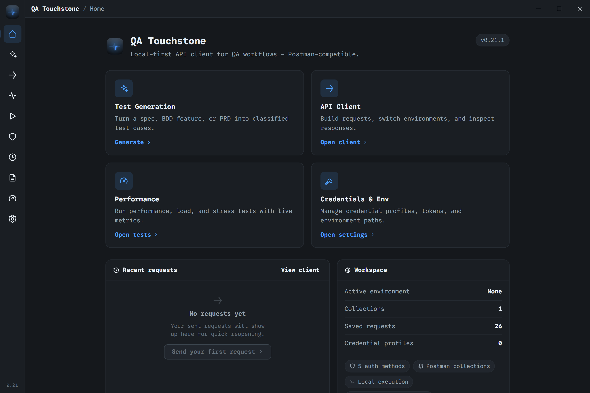
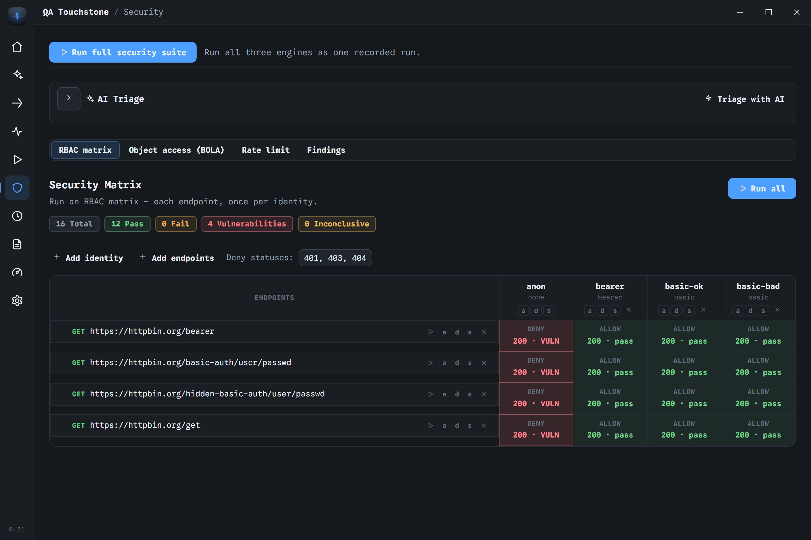
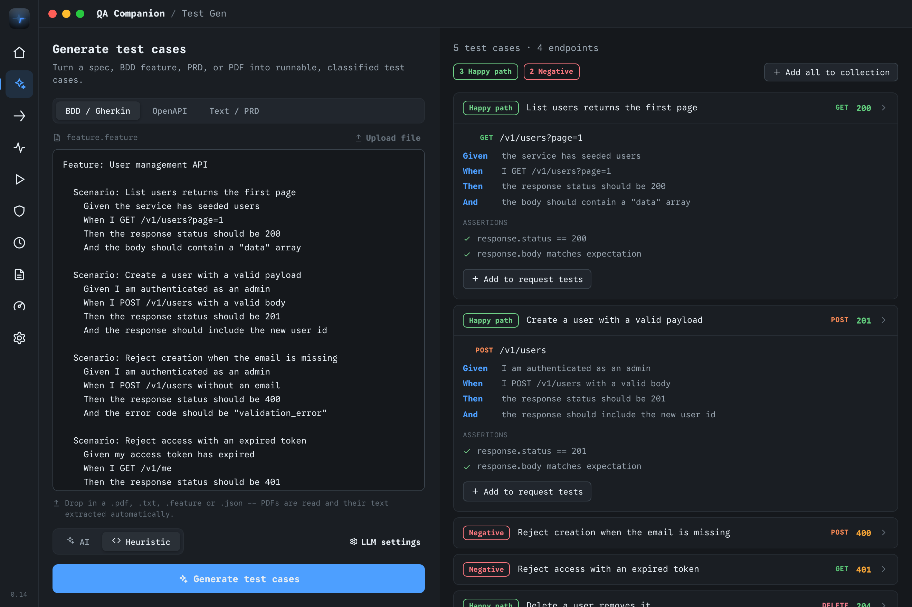
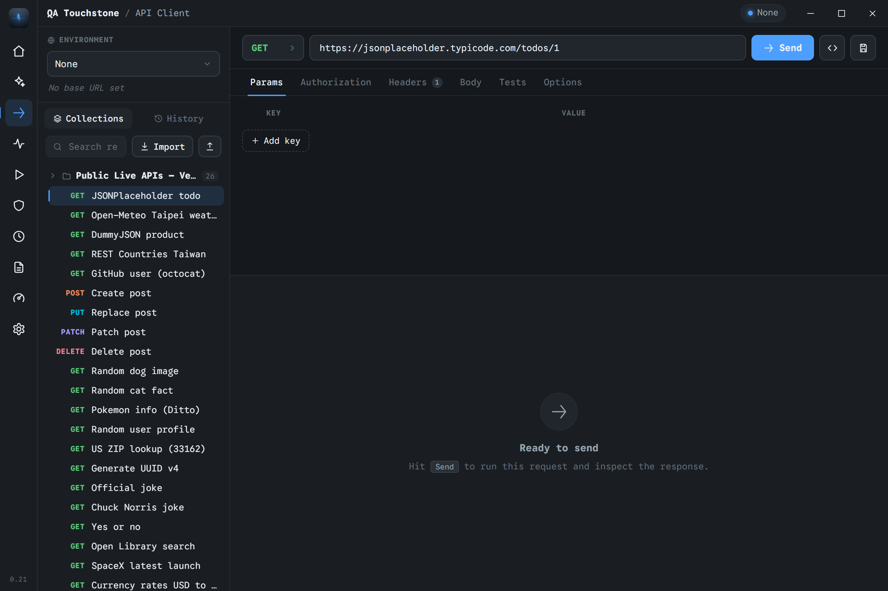
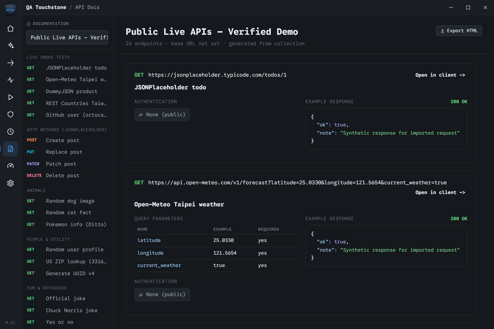
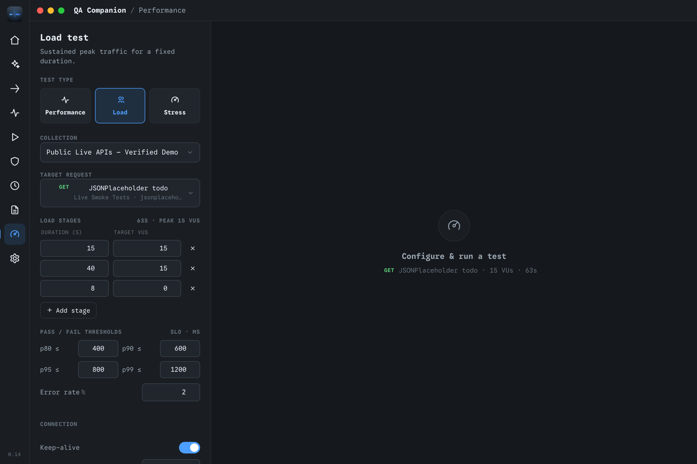
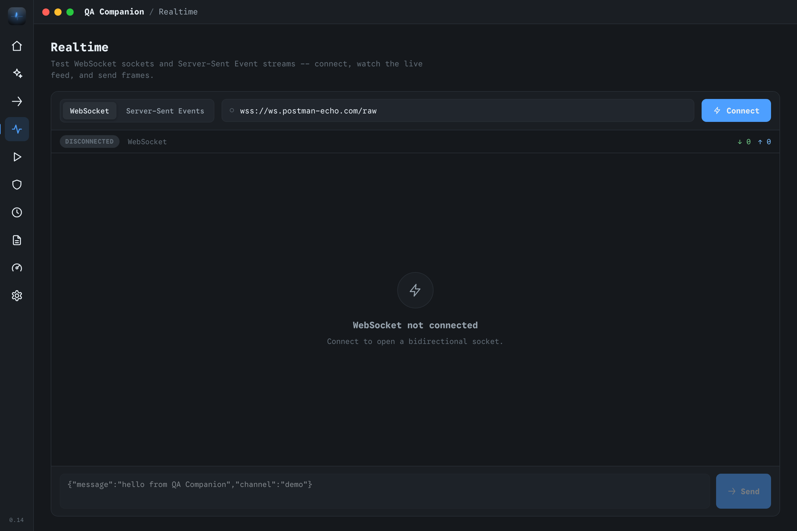
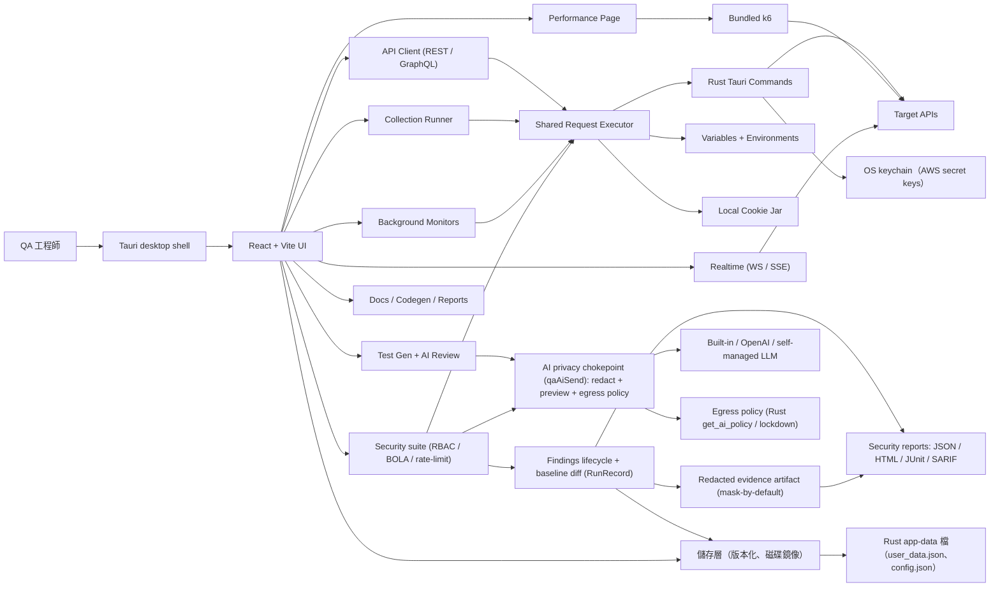

# QA Touchstone

[](https://github.com/asdfghj1237890/qa-touchstone/actions/workflows/ci.yml)
[](#license)
[](#架構)
[](#架構)
[](#架構)
[](#開發)
[](#開發)
[](#k6-binary)
[](#本機資料與-secrets)

[English](README.md)

QA Touchstone 是一個本機優先、**為 CI 做 API 安全測試**的桌面工具：
對真實 API 執行身分 × 端點的 RBAC 矩陣、BOLA/IDOR 物件授權測試與速率限制
濫用檢查，跨執行管理 findings 並與 baseline 比對，再匯出 **SARIF / JUnit /
HTML / JSON** 產物供 pipeline 把關。圍繞這個核心，它也提供完整的支援工作台
——Postman 相容 API client（REST 與 GraphQL）、collection 真實執行、背景
monitors、k6 效能測試、AI 測試案例產生與分流、可匯出的 API 文件——整合在
同一個 Tauri app 裡。

## 畫面截圖

**本機優先、相容 Postman 的桌面 API QA 工作台** — API client、collection runner、
安全矩陣、monitors、效能測試與可匯出文件，全部整合在一個 app。



| 安全矩陣（RBAC） | AI 測試產生 | API client |
| --- | --- | --- |
|  |  |  |
| **產生的 API 文件** | **效能 / 負載測試** | **Realtime（WebSocket / SSE）** |
|  |  |  |

<sub>重生指令：開著 dev server 時執行 `node scripts/capture-screenshots.mjs`（用系統 Chrome 透過 DevTools Protocol 驅動；介面截圖預設英文，要中文介面設 `LOCALE=zh-TW`）。</sub>

## 目前範圍

目前公開版聚焦在 API 測試：

- Generic API environments：local、staging、production，以及自訂目標
- 透過 Tauri desktop backend 執行本機 request
- Browser/dev fallback，方便測試穩定與快速 UI 迭代
- Runtime data 與 credentials 儲存在本機
- 不包含公司內部服務、內部連結，或已淘汰的非 API workflow 文件

## 功能

- **API client**：建立 HTTP 與 GraphQL requests（內含 schema explorer）、切換
  environments、檢視 responses、查看 call history，並把 responses 與 history
  匯出成 HTML、JSON 或 CSV 報告。
- **Import/export**：匯入 Postman v2.1 collections 與 OpenAPI/Swagger JSON；
  也可匯出為 Postman JSON。
- **Authentication**：No Auth、Bearer Token、OAuth 2.0（authorization-code、
  client-credentials、password grants）、API Key、Basic Auth、AWS SigV4。
- **Variables and cookies**：解析 global、collection、environment、local
  variables，以及動態值（{{$timestamp}}、{{$guid}}、{{$randomInt}}）；
  透過本機 cookie jar replay 符合 domain/path 的 cookies。
- **Collection Runner**：批次執行選定 requests，支援 CSV/JSON data
  iteration，並用 live responses 計算 assertions。
- **安全測試（Security testing）**：執行身分 × 端點的 RBAC 矩陣——同一批已存
  requests 用多個身分各送一次——可逐格設定 allow/deny 預期、可調的拒絕狀態碼集合，
  並以 response oracles 標示敏感資料外洩與 schema 偏移。矩陣 oracle 會看 body：
  回 200 但內文實際拒絕（`{"error":"Access denied"}`）會被判定為 denied，而不是
  誤報的 vuln。物件層級授權（BOLA/IDOR）
  測試在不同身分間替換物件 id，支援自動偵測 id 位置、可重用的跨租戶 presets，以及
  避免誤判的 negative control（物件 id 回顯只在「像身分」的 key 上才算數，且
  control 改用獨立的結構 oracle 評分）。速率限制 / 濫用測試在確認關卡後送出有上限的
  request bursts，並依「第一個 429 出現前放行了幾個 request」把防護分級為
  none / weak / strong。
  單一 **執行完整安全掃描（Run full security suite）** 會把三個引擎當成一次已記錄的
  執行依序跑完——速率限制放最後，避免其 bursts 影響矩陣與 BOLA 的結果。
  另有三個新引擎——JSON-Schema/OpenAPI **conformance** 驗證、輸入 **fuzzing**
  （偵測 5xx、stack-trace 洩漏、payload 反射）與自動推導的 **BFLA**（OWASP API5）
  掃描——以純函式、完整單元測試的模組形式出貨，SARIF 規則中繼資料已備妥於報告層；
  UI 整合是下一步。
- **AI 安全分流（AI security triage）**：把整批掃描（矩陣 + 物件授權 + 速率限制）
  濃縮成一份簡短、依優先序分類的清單——先看哪幾個、哪些像真的問題、哪些可能是誤判
  ——僅供參考，不會更動底層 findings。
- **發現生命週期（Findings lifecycle）**：抑制誤判、覆寫嚴重度、指派負責人/狀態/備註，
  並將每次掃描與釘選的基準（baseline）比對——新增/延續/已消失標記，加上新增高/嚴重計數。
- **安全報告 / CI 產物（Security reports / CI artifacts）**：將一次完整的 suite 執行
  匯出為 JSON 產物、HTML 主管報告、JUnit XML（CI 測試檢查）或 SARIF（GitHub code
  scanning）——以「新增的高/嚴重發現」作為 gate，並提供三段遮蔽等級給離開本機的產物：
  `strict` 完全不含佐證、`redacted` 保留短遮罩值、`evidence` 再附上一份結構保留、
  **預設遮掩（mask-by-default）** 的 request/response 摘要以定位每筆發現——除了發現本身那一個
  葉節點外，其餘值一律型別化，確保 token、cookie、PII 永不外洩。該佐證摘要為即時生成，
  僅在明確選擇時才落地進該次執行。SARIF 輸出已可直接餵 code scanning：每條 rule
  帶名稱、完整描述、`helpUri`、CWE/OWASP tags 與 GitHub `security-severity`
  分數，每筆 result 附 `physicalLocation`。
- **Monitors**：可手動觸發真實 collection checks；啟用後也會在 app
  執行期間依照設定的 cadence 自動執行。
- **Performance testing**：產生並執行 k6 performance、load、stress tests，
  提供 live metrics、SLO scoring、history 與可匯出的 reports。
- **AI assistance**：從 BDD、OpenAPI、PRD 或類 PDF 文字產生分類好的測試案例；
  也能針對單筆 API response 對照既有 assertions 做 review；並可隨時掃描單筆
  response 找出敏感資料外洩（PII、secrets、內部或 debug 欄位）。
- **可設定的 AI 供應商（Configurable AI provider）**：所有 AI 功能（測試產生、
  response review、敏感資料掃描、安全分流）都跑在你選的供應商上——OpenAI，
  或自訂 / 企業自管（on-prem）的 OpenAI 相容 endpoint——憑證只留在本機。
  AI 功能是可選的：未設定供應商時，測試產生會 fallback 到內建的 heuristic
  引擎，其餘功能完全可用。（「內建 Claude 免 key」供應商只在 UI 跑在
  claude.ai Artifacts 沙箱內時可用——**桌面版安裝檔中無法使用**；設定頁會
  即時顯示其可用狀態。）
- **AI 隱私模式（AI privacy mode）**：所有 AI 呼叫都經過單一 egress chokepoint，
  且預設遮蔽。三段模式——`full context`、`redacted`（預設）、`local only`
  ——決定哪些資料離開裝置。`redacted` 在送出前於本機遮蔽 URL（去 host）、回應內容
  （結構保留、值轉型別 token、保留 key 名）、headers 與識別碼（email、token、UUID、
  IP、Luhn 卡號、SSN），並把 OpenAPI 規格縮成 path shape（不送真實 host、不送 example
  值）；`local only` 封鎖雲端供應商、只允許自管端點（loopback／私網／已聲明）。送出前
  會顯示完整 prompt 預覽，且 CI／組織 lockdown（env `QA_ALLOW_EXTERNAL_AI`）可強制
  關閉外部 AI。
- **Docs and codegen**：產生 API docs、獨立 HTML 匯出，以及 request code
  snippets（cURL、Python、JavaScript、HTTPie）。
- **Realtime testing**：測試 WebSocket 與 Server-Sent Events streams。
- **雙語、可換主題的介面（Bilingual, themeable UI）**：完整的英文與繁體中文
  介面，可在設定切換；深色 UI 提供多組 accent 配色與密度選項。

## 架構



- **Frontend**：React 19 + Vite，**100% TypeScript**（strict）。Workspace、
  request/send、monitor 狀態都放在型別化的 React context provider
  （`src/qa/state/`）；共用領域型別在 `src/qa/types.ts`。
- **Desktop shell**：Tauri 2
- **Backend commands**：Rust——request execution（reqwest + 手動跟隨 redirect、
  AWS SigV4，並內建 SSRF 防護：擋下對雲端 metadata 位址的簽名請求）、k6 子程序
  執行器、temp-file 輔助、本機 config/data 持久化、OS keychain 機密儲存
  （`keyring`），以及由原生儲存對話框餵路徑的文字檔儲存指令。暴露給 renderer
  的指令面刻意維持最小（無 shell、無任意網路存取）；停用 TLS 驗證需要 renderer
  明確確認，且會留下稽核紀錄。
- **Storage**：單一版本化儲存層（`src/qa/storage.ts`，讀取時自動 migrate 舊資料
  形狀）透過 Rust 後端把關鍵
  工作區資料鏡像到磁碟；cookie jar 套用完整 Public Suffix List（`src/qa/psl.ts`）。
- **Performance engine**：k6，會 materialize 到 `src-tauri/resources/`
- **Tests + checks**：Vitest + Testing Library 與 Rust unit tests，CI 連同
  `tsc --noEmit`、ESLint、`npm audit`、`cargo audit` 一起把關；workflow
  actions 全數釘在 commit SHA。

## 專案狀態

持續維護中。前端已全面 strict TypeScript；每次 push 都會跑 ESLint、
`tsc --noEmit`、Vitest 測試、`npm audit` 與 Rust unit tests，且 release
流程在這些未通過前不會 build 安裝檔。逐版歷史見
[CHANGELOG.md](CHANGELOG.md)（近期工作：OS keychain 憑證儲存、強化
RBAC/BOLA/rate-limit oracles、三個新安全引擎——conformance、fuzzing、
BFLA——更完整的 SARIF，以及 React 19 升級）。

## 需求

- Node.js 20 或更新版本（CI 使用 22）
- npm
- Rust toolchain，用於 Tauri commands 與 desktop builds
- k6 由下方 setup scripts 處理

## 開發

<details open>
<summary>常用指令</summary>

安裝 dependencies：

```bash
npm install
```

啟動 frontend dev server：

```bash
npm run dev
```

以 development mode 啟動 Tauri desktop app：

```bash
npm run tauri:dev
```

執行測試：

```bash
npm test
```

型別檢查、lint 與格式化：

```bash
npm run typecheck
npm run lint
npm run format
```

建置 frontend：

```bash
npm run build
```

建置 desktop app：

```bash
npm run tauri:build
```

</details>

## k6 Binary

<details>
<summary>k6 setup 與 release 驗證</summary>

Performance page 會透過 k6 執行真實 load tests。k6 binary 體積較大且與平台相依，
所以不會 commit 到 repo。

Setup script 會把 k6 materialize 到 `src-tauri/resources/`：

- **Dev**：`npm run setup:k6` 如果已存在 k6 就不動；否則從 PATH 複製 `k6`，
  或下載 pinned release。
- **Release**：`npm run setup:k6:release` 會下載符合 OS/arch 的官方 artifact，
  使用 `scripts/setup-k6.mjs` 內建的 SHA256 checksums 驗證，並確認
  `k6 version` 後才 bundle。

手動執行：

```bash
npm run setup:k6
npm run setup:k6:release
```

若要更新 `K6_VERSION=<x.y.z>`，需要把該 release 的 checksums 加到
`scripts/setup-k6.mjs` 的 `CHECKSUMS` table。Release build 在 checksum
缺失或不一致時會 fail closed。

</details>

## 本機資料與 Secrets

<details>
<summary>儲存檔案與 secret 處理</summary>

Runtime configuration 儲存在本機。常見產生檔案包含：

- `config.json`：application settings
- `postman_collections_cache.json`：cached collection metadata
- `user_data.json`：關鍵工作區資料的磁碟鏡像（安全 findings 生命週期、
  baseline、效能歷史、monitors）。所有讀寫經過單一版本化儲存層
  （`src/qa/storage.ts`），webview 快取被清掉也能還原，舊資料形狀會在讀取時
  自動 migrate，寫入失敗會浮出
  提示而非無聲吞掉。機密（LLM API key）刻意排除在鏡像之外。

手動輸入的 AWS secret access key 不會存進 `config.json`：它存放在 OS keychain
（Windows Credential Manager／macOS Keychain／Linux Secret Service），以
credential profile id 為 key。舊設定中的 inline secret 讀取時仍然有效，方便
平順遷移。

LLM settings 儲存在 browser localStorage。AI 隱私模式預設遮蔽：prompt 會在本機
遮蔽、並於送出前顯示預覽,才送到你選擇的 provider;`local only` 模式只允許自管
端點,CI／組織 lockdown（`QA_ALLOW_EXTERNAL_AI`）可完全停用外部 AI。
請不要 commit credentials、generated cache files、local tokens 或
machine-specific paths。

安全執行記錄只會持久化一份壓縮、已遮蔽的 snapshot——絕不儲存 request/response body。
較完整的「已遮蔽佐證摘要」僅在當前工作階段保留在記憶體，唯有你明確選擇時才會寫入
已儲存的執行（或釘選的 baseline）。

</details>

## Packaging Notes

<details>
<summary>macOS、Windows 與 Gatekeeper notes</summary>

macOS build 會在 `src-tauri/target/release/bundle/dmg/` 產生 `.dmg`。
Windows build 會同時產生 NSIS installer（`-x64-setup.exe`）與一個免安裝的
portable ZIP（`-x64-portable.zip`，內含執行檔與旁邊的 `resources/k6.exe`）。
本機要組 portable ZIP 可執行 `npm run package:portable`，輸出到 `dist/`
（與 release workflow 同一套步驟）。
macOS k6 binary 會 bundle 到 app 的
`Contents/Resources/resources/k6`，所以 Performance testing 不需要額外安裝
system k6。

目前 macOS build 尚未使用 Apple Developer ID sign/notarize。第一次啟動時，
Gatekeeper 可能會擋下。可以右鍵 app 選 **Open**，或清除 quarantine：

```bash
xattr -dr com.apple.quarantine "/Applications/QA Touchstone.app"
```

若要更廣泛發佈，請 sign 並 notarize build。

</details>

## Credits

- **效能測試**由 [Grafana k6](https://k6.io)
  （[`grafana/k6`](https://github.com/grafana/k6)）提供，採
  [AGPL-3.0](https://github.com/grafana/k6/blob/master/LICENSE.md) 授權。官方
  k6 binary 會經下載、SHA256 驗證後 bundle 到 app 的 `resources/` 目錄（見
  [k6 Binary](#k6-binary) 與 [Packaging Notes](#packaging-notes)）。它以獨立執行檔
  的方式被 app 呼叫，並未連結進 QA Touchstone 本體。感謝 Grafana Labs 團隊與
  k6 contributors。
- 以 [Tauri](https://tauri.app) 與 [React](https://react.dev) 打造。

各商標與專案名稱歸其各自所有者所有。

## License

ISC
