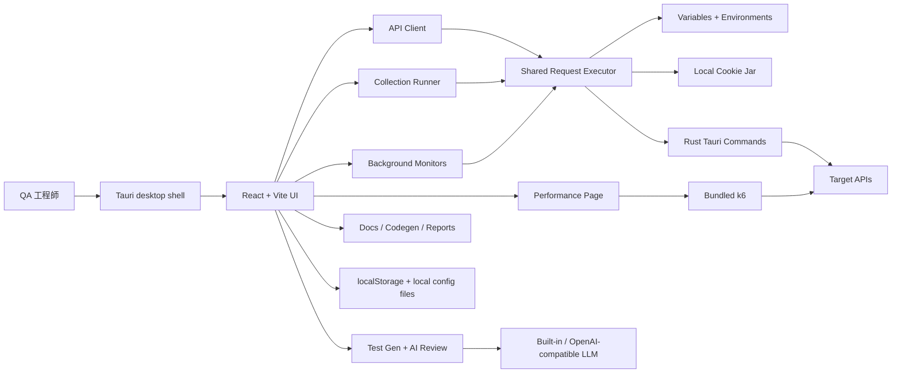

# QA Touchstone

[](#license)
[](#架構)
[](#架構)
[](#開發)
[](#開發)
[](#k6-binary)
[](#本機資料與-secrets)

[English](README.md)

QA Touchstone 是一個本機優先的桌面 API QA 工作台。它把
Postman 相容 API client、collection 真實執行、背景 monitors、k6 效能測試、
安全測試（RBAC、物件授權、速率限制）與 AI 分流、AI 測試案例產生、
AI response review，以及可匯出的 API 文件整合在同一個 Tauri app 裡。

## 畫面截圖

**本機優先、相容 Postman 的桌面 API QA 工作台** — API client、collection runner、
安全矩陣、monitors、效能測試與可匯出文件，全部整合在一個 app。


| 安全矩陣（RBAC） | AI 測試產生 | API client |
| --- | --- | --- |
|  |  |  |
| **產生的 API 文件** | **效能 / 負載測試** | **Realtime（WebSocket / SSE）** |
|  |  |  |

<sub>重生指令：開著 dev server 時執行 `node scripts/capture-screenshots.mjs`（用系統 Chrome 透過 DevTools Protocol 驅動；介面截圖預設英文，要中文介面設 `LOCALE=zh-TW`）。</sub>

## 目前範圍

目前公開版聚焦在 API 測試：

- Generic API environments：local、staging、production，以及自訂目標
- 透過 Tauri desktop backend 執行本機 request
- Browser/dev fallback，方便測試穩定與快速 UI 迭代
- Runtime data 與 credentials 儲存在本機
- 不包含公司內部服務、內部連結，或已淘汰的非 API workflow 文件

## 功能

- **API client**：建立 HTTP requests、切換 environments、檢視 responses、
  查看 history，並匯出 response reports。
- **Import/export**：匯入 Postman v2.1 collections 與 OpenAPI/Swagger JSON；
  也可匯出為 Postman JSON。
- **Authentication**：No Auth、Bearer Token、OAuth 2.0、API Key、
  Basic Auth、AWS SigV4。
- **Variables and cookies**：解析 global、collection、environment、local
  variables；透過本機 cookie jar replay 符合 domain/path 的 cookies。
- **Collection Runner**：批次執行選定 requests，支援 CSV/JSON data
  iteration，並用 live responses 計算 assertions。
- **安全測試（Security testing）**：執行身分 × 端點的 RBAC 矩陣——同一批已存
  requests 用多個身分各送一次——可逐格設定 allow/deny 預期、可調的拒絕狀態碼集合，
  並以 response oracles 標示敏感資料外洩與 schema 偏移。物件層級授權（BOLA/IDOR）
  測試在不同身分間替換物件 id，支援自動偵測 id 位置、可重用的跨租戶 presets，以及
  避免誤判的 negative control。速率限制 / 濫用測試在確認關卡後送出有上限的 request bursts。
- **AI 安全分流（AI security triage）**：把整批掃描（矩陣 + 物件授權 + 速率限制）
  濃縮成一份簡短、依優先序分類的清單——先看哪幾個、哪些像真的問題、哪些可能是誤判
  ——僅供參考，不會更動底層 findings。
- **Monitors**：可手動觸發真實 collection checks；啟用後也會在 app
  執行期間依照設定的 cadence 自動執行。
- **Performance testing**：產生並執行 k6 performance、load、stress tests，
  提供 live metrics、SLO scoring、history 與可匯出的 reports。
- **AI assistance**：從 BDD、OpenAPI、PRD 或類 PDF 文字產生分類好的測試案例；
  也能針對單筆 API response 對照既有 assertions 做 review；並可隨時掃描單筆
  response 找出敏感資料外洩（PII、secrets、內部或 debug 欄位）。
- **可設定的 AI 供應商（Configurable AI provider）**：所有 AI 功能（測試產生、
  response review、敏感資料掃描、安全分流）都跑在你選的供應商上——內建 Claude
  （免 API key）、OpenAI，或任何 OpenAI 相容的 endpoint——憑證只留在本機。
- **Docs and codegen**：產生 API docs、獨立 HTML 匯出，以及 request code
  snippets。
- **Realtime testing**：測試 WebSocket 與 Server-Sent Events streams。

## 架構



- **Frontend**：React 18 + Vite
- **Desktop shell**：Tauri 2
- **Backend commands**：Rust，包含 request execution、process helpers 與本機
  file operations
- **Performance engine**：k6，會 materialize 到 `src-tauri/resources/`
- **Tests**：Frontend 使用 Vitest + Testing Library；Tauri helpers 使用 Rust
  unit tests

## 這次重構調整

<details>
<summary>重構重點</summary>

- 將產品定位整理成 API QA workflow，不再沿用早期較寬泛的桌面工具描述。
- 從公開 README 與 docs 移除已淘汰的非 API workflow 描述。
- 保留現在最有價值的 API 測試面：import、send、run、monitor、review、
  document、export、performance test。
- 強化真實執行路徑：Runner 與 Monitors 會用 live response 評估 assertions，
  而不是只看 demo 資料。
- 加入 app-level monitor scheduler；app 開著時，enabled monitors 會依 cadence
  自動執行。
- LLM 使用集中到共用設定，供 Test Gen 與 response review 使用。

</details>

## 需求

- Node.js 18 或更新版本
- npm
- Rust toolchain，用於 Tauri commands 與 desktop builds
- k6 由下方 setup scripts 處理

## 開發

<details open>
<summary>常用指令</summary>

安裝 dependencies：

```bash
npm install
```

啟動 frontend dev server：

```bash
npm run dev
```

以 development mode 啟動 Tauri desktop app：

```bash
npm run tauri:dev
```

執行測試：

```bash
npm test
```

建置 frontend：

```bash
npm run build
```

建置 desktop app：

```bash
npm run tauri:build
```

</details>

## k6 Binary

<details>
<summary>k6 setup 與 release 驗證</summary>

Performance page 會透過 k6 執行真實 load tests。k6 binary 體積較大且與平台相依，
所以不會 commit 到 repo。

Setup script 會把 k6 materialize 到 `src-tauri/resources/`：

- **Dev**：`npm run setup:k6` 如果已存在 k6 就不動；否則從 PATH 複製 `k6`，
  或下載 pinned release。
- **Release**：`npm run setup:k6:release` 會下載符合 OS/arch 的官方 artifact，
  使用 `scripts/setup-k6.mjs` 內建的 SHA256 checksums 驗證，並確認
  `k6 version` 後才 bundle。

手動執行：

```bash
npm run setup:k6
npm run setup:k6:release
```

若要更新 `K6_VERSION=<x.y.z>`，需要把該 release 的 checksums 加到
`scripts/setup-k6.mjs` 的 `CHECKSUMS` table。Release build 在 checksum
缺失或不一致時會 fail closed。

</details>

## 本機資料與 Secrets

<details>
<summary>儲存檔案與 secret 處理</summary>

Runtime configuration 儲存在本機。常見產生檔案包含：

- `config.json`：application settings
- `postman_collections_cache.json`：cached collection metadata
- `api_credential_configs.json`：可重複使用的 API credential profile metadata

LLM settings 儲存在 browser localStorage，並直接送到你選擇的 provider。
請不要 commit credentials、generated cache files、local tokens 或
machine-specific paths。

</details>

## Packaging Notes

<details>
<summary>macOS、Windows 與 Gatekeeper notes</summary>

macOS build 會在 `src-tauri/target/release/bundle/dmg/` 產生 `.dmg`。
Windows build 會產生 NSIS installer。macOS k6 binary 會 bundle 到 app 的
`Contents/Resources/resources/k6`，所以 Performance testing 不需要額外安裝
system k6。

目前 macOS build 尚未使用 Apple Developer ID sign/notarize。第一次啟動時，
Gatekeeper 可能會擋下。可以右鍵 app 選 **Open**，或清除 quarantine：

```bash
xattr -dr com.apple.quarantine "/Applications/QA Touchstone.app"
```

若要更廣泛發佈，請 sign 並 notarize build。

</details>

## License

ISC
